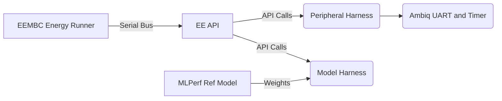

# MLPerf Tiny on Apollo4 Plus

[MLPerf Tiny](https://github.com/mlcommons/tiny) is a [collection of small TFLu-based benchmarks](https://github.com/mlcommons/tiny/tree/master/benchmark/reference_submissions) measuring performance and energy use for typical TinyML AI tasks. This repo instantiates Ambiq's version of these for submission to [MLCommons](https://mlcommons.org/en/inference-tiny-05/).

Note that these benchmarks are not meant to be standalone: they're meant to work with [an external test harness,](https://github.com/eembc/energyrunner) running specific tests.



## Getting Started

> **NOTE** The makefile makes use of SEGGER Jlink utilities and ARM GCC - installing and configuring these is outside the scope of this document.

> **NOTE** Apollo4 Plus code must be compiled seperately for ML Performance and ML Energy modes, as they use different UARTs.

To run the ML Performance suite, compile and deploy the code in performance mode (uses JLINK UART).

```bash
make clean
make BENCHMARK=keyword_spotting # replace keyword_spotting with any of the MLPerf Tiny Benchmarks
make TARGET=keyword_spotting deploy
```

To run the ML Energy suite, the make invocation is slightly different.

```bash
make clean
make BENCHMARK=keyword_spotting ENERGY_MODE=1
make TARGET=keyword_spotting deploy
```

`BENCHMARK` can be any of the MLPerf Tiny benchmarks (keyword_spotting, anomaly_detection, person_detection, or image_classification).

> **NOTE** Perform a `make clean` when switching between benchmarks or energy/performance modes

After deploying, the EEMBC Energy Running Framework can be used to initialize the DUT and run the benchmarks.

## Code Structure

The benchmarks are based on MLPerf Tiny's reference benchmarks, and the code structure remains similar, though refactored to avoid replication across the models. It is built using Ambiq's NeuralSPOT framework and has be tested with TF Lite for Microcontrollers version b04cd98.

```bash
libs/     # NeuralSPOT and Tensorflow static libraries
includes/ # headers for NeuralSPOT and Tensorflow static libraries
make/     # Makefile helpers and configs
src/
	am_utils/  # Ambiq UART and Timer utilities
	api/			 # MLPerf APIs
	utils/		 # MLPerf utilities
	training/  # Training scripts for MLPerf Tiny benchmarks (unchanged from reference)
	src/			 # Implementations of MLPerf Tiny benchmarks
Makefile
```

### Makefile Arguments

Our Makefile takes the following arguments:

```make BENCHMARK=<benchmark_name> MLPERF=<0/1> MLDEBUG=<0/1>  ENERGY_MODE=<0/1>```

The `benchmark_name` is one of the following `keyword_detection`, `person_detection`, `anomaly_detection`, or `image_classfication`. The default is `keyword_detection`.

The makefile will build the binary in either debug or release mode, and in either performance or power modes.

| Make Arg      | Description                                                  | Intent                                                       |
| ------------- | ------------------------------------------------------------ | ------------------------------------------------------------ |
| MLDEBUG=1     | This links the **debug** version of the TFLu library, enables debug prints, and compiles with no optimization and all symbols | Make debug in GDB easier                                     |
| MLDEBUG=0     | This links the **release** version of the TFLu library; it disables debug prints, and compiles with all optimizations enabled and symbols disabled (default) | Run the benchmark                                            |
| MLPERF=1      | Compiles with high performance mode enabled (turns on 192MHz clock) by defining `AM_MLPERF_PERFORMANCE_MODE` | Enable max perf for benchmark                                |
| MLPERF=0      | Compiles with low power enabled (LP mode) (default)          | Enable lowest power mode for power benchmarks                |
| ENERGY_MODE=1 | Compiles for energy mode (requires EEMBC energy manager and power monitor). Sends results via UART3. | Official power measurements via EEMBC EnergyRunner system.   |
| ENERGY_MODE=0 | Compiles for performance mode (uses Jlink UART).             | Official accuracy and performance measurements via EEMBC EnergyRunner. |

Note that to step into Tensorflow's C++ code you will have to point the makefile to a full Tensorflow source directory, which is not included in this repo. See the Debugging section below.

### Energy Mode Configuration

Measure MLPerf energy metrics requires specific hardware as described on the EEMBC MLPerf Tiny page. Among other things, we need to route th_printf statements to a UART other than the one we use for Jlink (UART0) and send a timestamp signal (rather than reading a timer) via a GPIO. We use UART3 (TX on pin 61 and RX on pin 63) and GPIO pin 22 for the timestamp.


