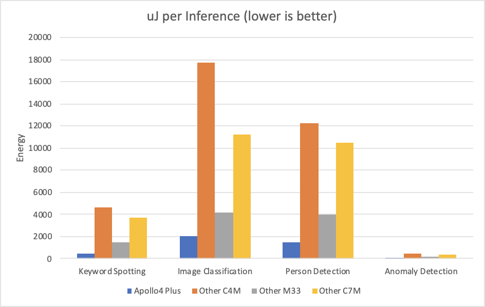

# Full Performance, Ludicrously Low Power

Adding AI features to your endpoint solutions is an exercise in tradeoffs - AI is notoriously resource-intensive, consuming prodigous amounts of CPU cycles, memory, and power. The TinyML movement is working hard at addressing the first two problems - here at Ambiq we're obssesed with energy efficiency. Our hardware and software work together to deliver the best fit to your solution's AI requirements.

This obsession has resulted in the most power efficient inference benchmark results by a large margin.

## How We Benchmarked Apollo4 Plus

We chose to use the [MLPerf Tiny](https://github.com/mlcommons/tiny) benchmark suite, which includes four common endpoint AI tasks: keyword spotting, image classification, person detection, and anomaly detection. MLPerf Tiny is a tightly-controlled benchmark, with strict rules for the workloads, the types of optimizations that are allowed, and how the results are measured.

In order to produce the most useful apples-to-apples information for our customers, we followed all these rules when benchmarking our platform, and kept our implementation as 'vanilla' as possible. This means we used the off-the-shelf reference models running unmodified Tensorflow Lite for Microcontrollers, and restricted our optimization efforts to coarse-grained basics rather than engaging in benchmark-specific fine-tuning. 

It's important to note that, while we followed all of MLPerf Tiny's Close Benchmark rules, **these are not official results** since they were not submitted for review for the current round. However, we've made our benchmark repository public so that the results can be replicated as needed.

The details of our optimizations are in the repository (and we encourage developers to use them as reference optimization guides), but in short we limited ourselves to turning off anything we weren't using (ADCs, UARTs, Bluetooth, etc), and choosing the best memories for weights and activations.

### Benchmarking 101

Benchmarks are most useful when you know how to interpret them. In MLPerf Tiny's case, the current suite  focuses exclusively on AI inference. While this is usually the most intensive part of an AI feature, it represents only a fraction of the overall energy utilization needed to implement a feature.

For example, a real-world end-to-end usecase such as speech-to-intent inference might spend many seconds capturing audio and only a few tens of milliseconds performing inference on it. The MLPerf Tiny suite only measures the inference portion of that, but even if that energy could be reduced to zero, the overall power budget would only reduced by a fraction. It is important to [optimize everything](https://github.com/AmbiqAI/neuralSPOT/blob/main/docs/optimizing_using_neuralspot.md), not just inference.

## Apollo4 Plus' Astounding AI Power Efficiency

As briefly mentioned above, Apollo4 Plus outperformed every other measured MCU-based platform by a wide margin, thanks to SPOT. This held true across the entire suite.

> **Note** Based on [MLPerf Tiny v0.7 published results](https://mlcommons.org/en/inference-tiny-07/). For results other than Apollo4 Plus', we show the best submitted results for that CPU architecture. Further note that these other results may not be based on Tensorflow Lite for Microcontrollers (the least efficient runtime) so the comparison may not be apples-to-apples

As the results show, the Apollo4 Plus power advantage ranges from **300% to 930%** higher energy efficiency, which it is able to accomplish without increased latency.

### Replicating Our Results

Full instructions for replicating our results can be found at our [MLPerfTiny](https://github.com/AmbiqAI/MLPerfTiny) GitHub repository.